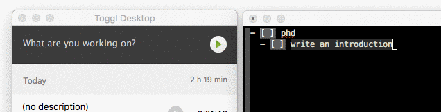

emacs-toggl
==============================================================================

A simple Emacs extension to work with [Toggl](https://toggl.com/).

For now it has only on function:

 - `toggl-start-task`

Install
-------------------------------------------------------------------------------

Load the el file in your `.emacs`, e.g.:

    (load-file "~/.emacs.d/plugins/emacs-toggl/emacs-toggl.el")

Keybinding
-------------------------------------------------------------------------------

My keybinding for the function:

    (global-set-key (kbd "C-c T") 'toggl-start-task)

Alternatives
-------------------------------------------------------------------------------
- https://github.com/mattduck/org-toggl-py
